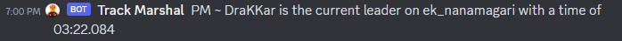

# KBT-leaderboard

Send a discord webhook whenever some driver is validating new record for a leaderboard in some track. Note that this is an ongoing project and everything is still in a bad state.

## Technologies Used

- Cloudflare Worker
- Cloudflare KV
- NestJS
- Vercel to host the backend scraper

The initial idea was to scrape KBT leaderboard directly inside the worker, but for some reason Cloudflare Worker restrict fetching directly to an IP address, the leaderboard website is using an IP address as the domain.

If there is a workaround for this I might move the scraper into the Cloudflare Worker instead of seperating them.

## Demo

